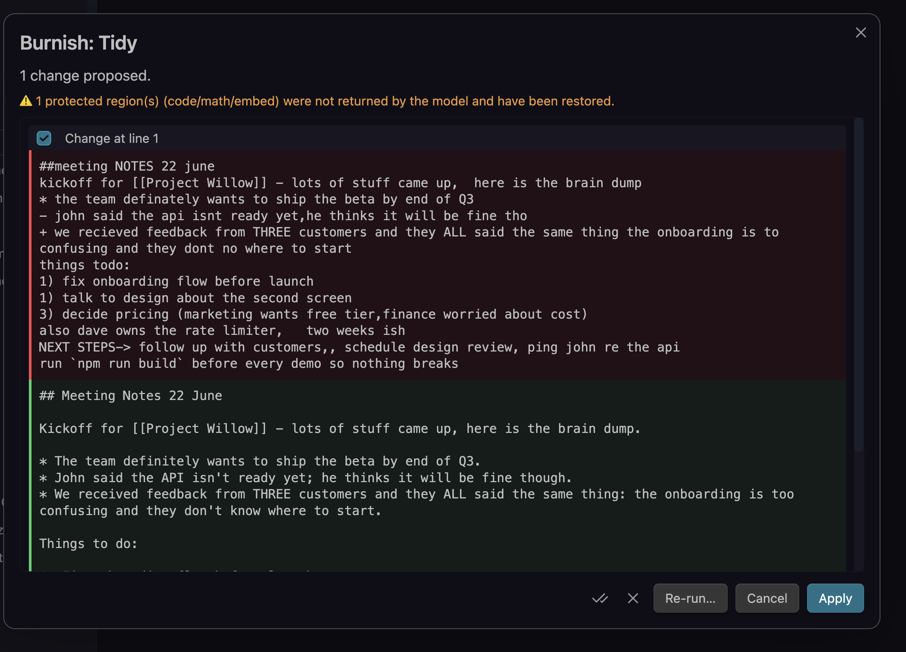
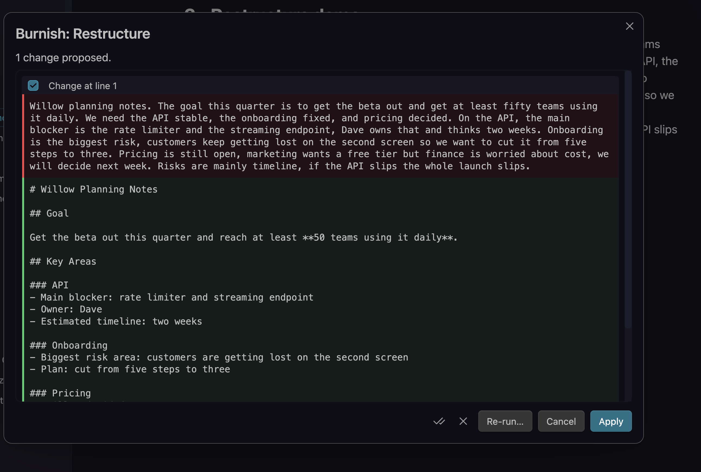
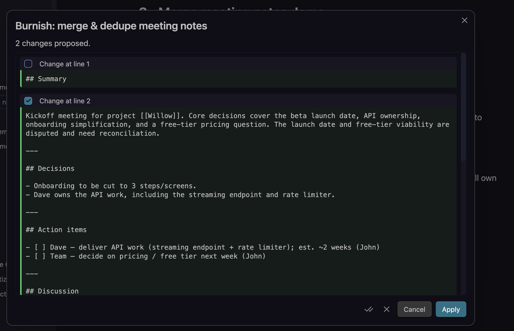
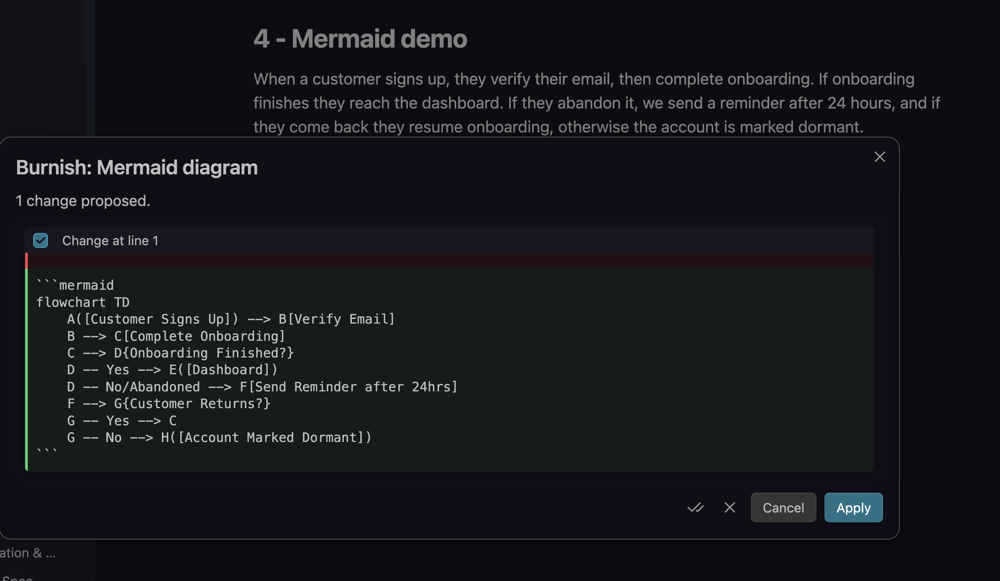
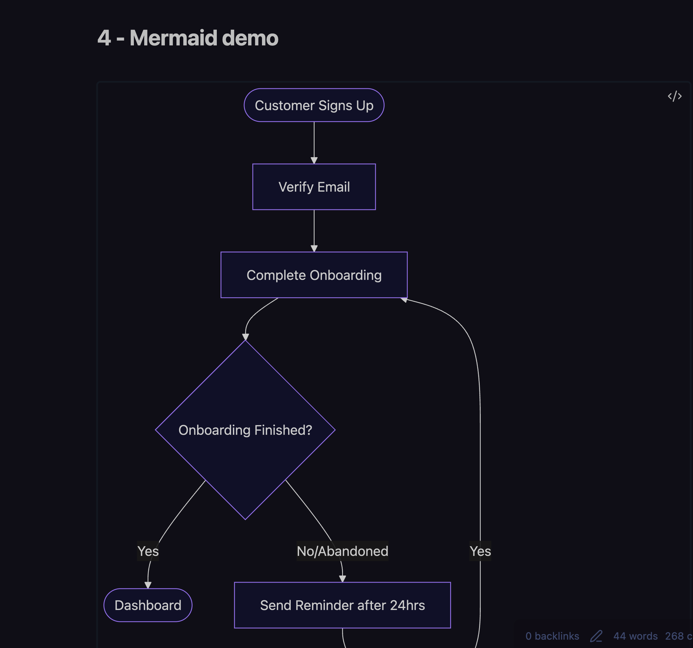

# Burnish

> Polish your notes with an LLM, like burnishing a stone.

Burnish sends the current note (or selection) to an LLM, applies a cleanup action, and
**always shows a diff preview with per-hunk accept/reject before anything is written**. Edits
apply as a single undo step, and code, math, embeds and frontmatter are protected from changes.

Use a one-tap preset (Tidy, Restructure, Distill...), write your own reusable prompts, generate
Mermaid diagrams and tables, build a Map of Content, or merge several people's meeting notes into
one deduplicated note without losing information.

## Screenshots

**Tidy** - fix grammar, spelling and punctuation, with a per-hunk diff before anything is written:



**Restructure** - turn a wall of text into clean headed sections:



**Merge & dedupe meeting notes** - combine several people's notes into one structured note,
flagging conflicts that need reconciliation:



**Generate a Mermaid diagram** from prose, previewed then inserted at the cursor:





## Features

- **Diff preview, always.** Every change is shown as a per-hunk diff you accept or reject. Nothing
  is written until you click Apply, and Apply is a single Cmd/Ctrl-Z undo.
- **Presets and custom prompts** share one mechanism. Edit the built-ins or add your own, each with
  an optional hotkey, command and context-menu entry.
- **Prompt variables** - `{{title}}`, `{{date}}`, `{{selection}}`, `{{path}}`, `{{frontmatter.key}}`,
  `{{grit}}`.
- **Grit levels** (light / medium / deep) control rewrite aggressiveness.
- **Per-folder defaults** - different default action/model by path glob.
- **Merge & dedupe meeting notes** into one structured note, flagging conflicts and keeping
  anything unmergeable verbatim in an appendix.
- **Generative**: Mermaid diagrams and Markdown tables (inserted at the cursor), and Map-of-Content
  scaffolding across notes.
- **Protected regions** - fenced code, inline code, math, embeds and YAML frontmatter are masked
  before sending and restored after.
- **History & rollback** - Burnish snapshots a note before it rewrites it, so any edit (including
  batch and scheduled runs) can be rolled back.
- **Batch & scheduled** - run an action across many notes, or tidy a folder once a day.
- **Cost guard** - warns before sending very large notes.

## Network use

Burnish makes network requests **only to the LLM provider you configure**, and only when you
trigger an action. There is no other network activity. Specifically:

- **Anthropic** - requests go to `https://api.anthropic.com` (or a base URL you set).
- **OpenAI-compatible** - requests go to the **base URL you enter** (OpenAI, OpenRouter, Groq, or a
  local server such as Ollama / LM Studio / vLLM). Nothing is sent anywhere else.
- **Burnish (optional, hosted)** - if you sign up with your email, requests go to the Burnish
  gateway, which forwards them to a model provider using its own key. No API key needed. See
  **Privacy** below.

The content sent is the note or selection you run an action on (with code/math/embeds/frontmatter
masked) plus your instruction. Your API keys are sent only to the provider they belong to.

## Privacy & data

- **Burnish itself collects no data and contains no telemetry or analytics.**
- With your **own API key** (the default, free), your note content goes **directly from Obsidian to
  the provider you chose**. Burnish operates no server in this mode and never sees your content.
- Your API key (BYOK) or your Burnish account token (issued at email signup) is stored in this
  plugin's settings inside your vault (`data.json`). **Obsidian does not encrypt plugin settings** -
  treat the file accordingly.
- The optional hosted **Burnish** tiers (Free and Pro) process note content transiently on the
  server to proxy the model call and do not retain note content. Full details are in
  [PRIVACY.md](PRIVACY.md).

## Plans

Burnish works two ways. **Bring your own key** stays fully free and unlimited - you never need an
account. **Burnish** (hosted) needs no API key: sign up with your email for the Free tier, and
upgrade to Pro for every action on stronger models.

| | Bring your own key | Burnish Free | Burnish Pro |
|---|---|---|---|
| Setup | Your own API key | Just your email | Just your email |
| Price | Free (you pay your provider) | Free | $5 / month or $25 / year |
| Tidy + Format cleanup | Yes | Yes | Yes |
| All other actions¹ | Yes | 3 one-time previews | Yes |
| Actions per month | Unlimited | 20 | 500 (fair use) |
| Model | You choose | Managed | Managed (stronger) |

¹ Restructure, Distill, Expand, Action items, Merge & dedupe, Mermaid diagrams, Table from prose,
Map of Content, and custom prompts. **Burnish Free** includes **3 lifetime previews** (total, not
per feature) of these on the Pro models, so you can try them before upgrading.

**No payment or account is required for any feature** - everything is available for free with your
own API key (or a free local model). The hosted tiers are a convenience for people who would rather
not manage a key. Payments are handled by [Polar](https://polar.sh) (Merchant of Record); Burnish
never sees your card details.

## Install

### From the community plugin browser
Once listed: Settings → Community plugins → Browse → search "Burnish" → Install → Enable.

### Manual
1. Download `main.js`, `manifest.json`, and `styles.css` from the latest
   [release](https://github.com/johncattrall/burnish/releases).
2. Copy them into `<your vault>/.obsidian/plugins/burnish/`.
3. Reload Obsidian and enable Burnish under Settings → Community plugins.

## Setup

1. Open Settings → Burnish.
2. Choose how to run it:
   - **Burnish** (default) - enter your email and click Start free. No API key needed.
   - **Bring your own key** - pick Anthropic or an OpenAI-compatible / local endpoint and paste your
     key (or set a local base URL).
3. Open a note and run **Burnish: Tidy** from the command palette, the ✨ ribbon icon, or the
   editor right-click menu. Review the diff and Apply.

## Usage

- **Selection vs. note** - if text is selected, the action runs on the selection; otherwise the
  whole note (frontmatter excluded).
- **Merge meeting notes** - `Burnish: Merge & dedupe meeting notes` (current note, or pick files).
- **History** - `Burnish: Version history for current note` to roll back.

## Hotkeys

Every preset **and** every custom prompt is registered as its own Obsidian command, so each can have
its own hotkey:

1. Open **Settings → Hotkeys**.
2. Search for **Burnish** (or the action's name, e.g. `Burnish: Tidy`).
3. Click the **+** next to a command and press your key combination.

Notes:

- Obsidian ships with no default hotkeys for Burnish, so there are no conflicts to clear; you bind
  only the ones you want.
- Commands run on the active note's selection (or the whole note if nothing is selected), exactly
  like triggering from the palette.
- When you **add or rename a prompt** in Burnish settings, its command updates immediately - the new
  `Burnish: <name>` entry appears in the Hotkeys list ready to bind. (After **deleting** a prompt,
  its command disappears from the list on the next Obsidian reload.)
- Useful ones to bind: `Burnish: Tidy`, `Burnish: Custom instruction…`, and `Burnish: Pick an
  action…` (the fuzzy picker) for one keystroke to everything.

## Development

```bash
npm install
npm run dev      # watch build
npm run build    # typecheck + production bundle
npm test         # unit tests (diff, protect, variables, chunk, history, generative)
```

This plugin is fully open source (MIT) - all the features above run with your own key, and you can
build it from source yourself. Only the optional hosted gateway that powers the Burnish Free/Pro
tiers is a separate, closed backend. This is a standard open-core setup: the plugin never depends on
the hosted service.

## Support

Burnish is free and will stay free with your own API key. If it saves you time and you would like
to say thanks, you can [buy me a coffee](https://buymeacoffee.com/johncattrall). It is entirely
optional and does not unlock anything.

## License

[MIT](LICENSE) © John Cattrall

Burnish is an independent community plugin and is not affiliated with or endorsed by Obsidian.
